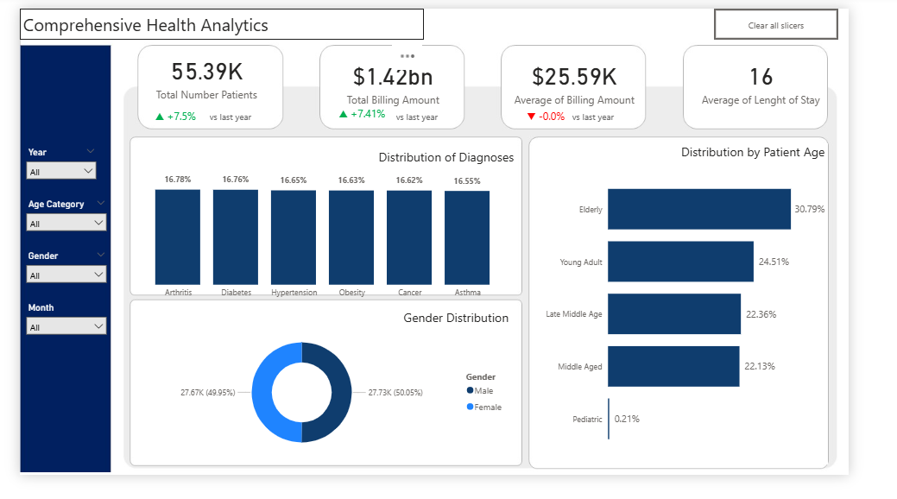

# 🏥 Healthcare EHR Data Analytics Project

---

## 📌 Project Overview

This project is a full-cycle **Healthcare Electronic Health Records (EHR) Data Analysis** performed using **Power BI and Excel**.

It demonstrates end-to-end data analytics skills including:
- Data cleaning and transformation
- Exploratory data analysis (EDA)
- Diagnostic analysis
- Rule-based predictive modeling
- Healthcare insight generation

The dataset includes patient demographics, clinical conditions, hospital admissions, billing information, and test outcomes.

---

## 🎯 Objectives

- Analyze patient demographics and healthcare utilization patterns  
- Identify trends in medical conditions and hospital operations  
- Explore relationships between clinical variables and test results  
- Build a rule-based predictive risk model  
- Develop a professional healthcare analytics dashboard  

---

## 🧰 Tools & Technologies

- Microsoft Excel (Data exploration & preprocessing)  
- Power BI (Data modeling & visualization)  
- Power Query (Data cleaning & transformation)  
- DAX (Calculated columns & logic building)  

---

# 🧹 Data Preparation & Cleaning

## 📊 Dataset Overview
- 5000+ healthcare records  
- Patient-level EHR data  
- Multiple clinical and operational attributes  

## 🧼 Cleaning Steps
- Verified dataset structure and consistency  
- Checked and confirmed no exact duplicate records  
- Removed invalid negative billing values  
- Standardized data types (dates, numeric fields)  

## 🧠 Feature Engineering
Created new analytical features:
- **Length of Stay (LOS)** = Discharge Date − Admission Date  
- **Age Groups**:
  - Pediatric (0–17)
  - Young Adult (18–34)
  - Early Middle Age (35–49)
  - Late Middle Age (50–64)
  - Elderly (65+)
- **Admission Month** for time-based analysis  

---

# 📈 Descriptive Analysis (What happened?)

## 👥 Demographics
- Gender distribution is balanced:
  - Male: 50.05%
  - Female: 49.95%
- Elderly patients dominate (30.79%)
- Pediatric patients are minimal (0.21%)

---

## 🏥 Medical Conditions
All conditions are evenly distributed:
- Arthritis: 16.75%
- Diabetes: 16.73%
- Hypertension: 16.72%
- Obesity: 16.65%
- Cancer: 16.62%

👉 Indicates a **balanced dataset structure**

---

## 🧪 Test Results Distribution
- Normal: 33.06%
- Abnormal: 33.56%
- Inconclusive: 33.38%

👉 Perfectly balanced classification target variable

---

# 🔍 Diagnostic Analysis (Why did it happen?)

## 💰 Billing Analysis
- Average billing is highly consistent across conditions (~25K–25.9K)
- Minimal variation between disease categories

👉 Suggests standardized or synthetic cost structure

---

## ⏳ Length of Stay
- LOS is mostly constant (15–16 days across conditions)

👉 Indicates limited variability in hospitalization duration

---

## 🧪 Test Results by Age Group
- Elderly: 30.70% Abnormal rate (highest)
- Young Adults: 24.08%
- Pediatric: 0.24%

👉 Shows strong correlation between age and abnormal outcomes

---

# 📊 Key Insights

- Age is the strongest predictor of abnormal test outcomes  
- Medical conditions show no significant variation in cost or LOS  
- Dataset is highly balanced across key variables  
- Likely represents a **synthetically structured dataset**  

---

# 🔮 Predictive Analysis (In Progress)

A rule-based predictive model is being developed in Power BI.

## Approach:
- Risk scoring system based on:
  - Age group
  - Medical condition severity
  - Length of stay

## Planned Outputs:
- Risk Score (Low / Medium / High)
- Predicted Risk vs Actual Test Results comparison
- Patient risk segmentation dashboard  

---

# 📌 Skills Demonstrated

- Data Cleaning (Power Query)  
- Data Modeling (Power BI)  
- DAX Calculated Columns  
- Feature Engineering  
- Healthcare Data Interpretation  
- Descriptive & Diagnostic Analytics  
- Rule-based Predictive Modeling  

---

# 🚀 Future Improvements

- Complete predictive validation dashboard  
- Add prescriptive analytics (recommendations for hospitals)  
- Improve model logic with weighted scoring  
- Publish interactive Power BI dashboard  

---

# 🧠 Project Summary

This project demonstrates a full healthcare analytics pipeline from raw EHR data to actionable insights using Power BI, showcasing both technical and analytical decision-making skills.

---

## 📬 Author

**Healthcare Data Analytics Project**  
Built for portfolio development in data analytics and healthcare insights.

---
